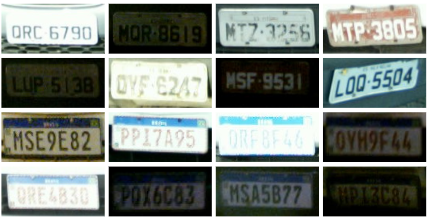
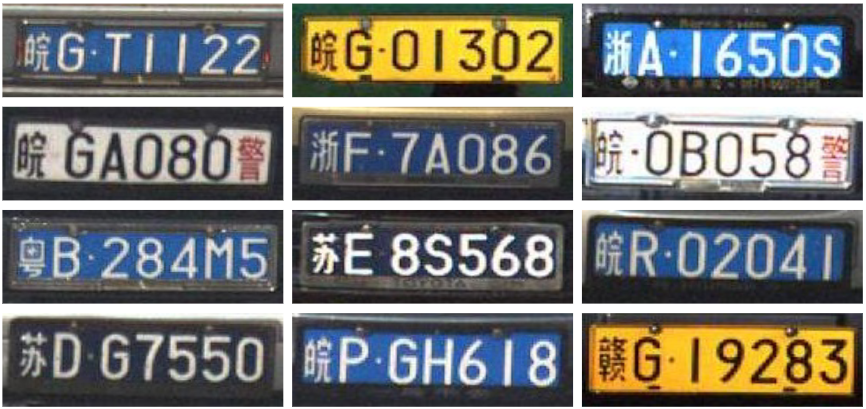
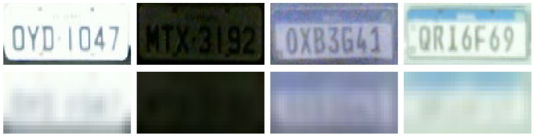

# Rodosol-LR-HR Dataset


The Rodosol-LR-HR dataset consists of 20,000 license plate (LP) images created from the [RodoSol-ALPR](https://github.com/raysonlaroca/rodosol-alpr-dataset) dataset. The RodoSol-ALPR dataset comprises 10,000 images of different car models captured during both day and night at distinct toll booths, under clear and rainy weather conditions.

Among the 10,000 original images, 5,000 images feature Mercosur and Brazilian LP layouts. Brazilian LPs consist of three letters followed by four digits, while the initial pattern adopted in Brazil for Mercosur LPs consists of three letters, one digit, one letter, and two digits, in that order (this pattern is adopted for all Mercosur LPs in the dataset). In both layouts, car LPs have seven characters arranged in a single row.

Here are some representative examples of the Rodosol-LR-HR dataset:


# PKU-LR-HR Dataset

The PKU-LR-HR dataset comprises images categorized into five distinct groups, namely G1 through G5, each representing a specific scenario. For example, G1 images were captured on highways during the day and depict a single vehicle, while G5 images were taken at crosswalk intersections, either during the day or night, and feature multiple vehicles. All images in this dataset were collected in mainland China. Despite the diverse settings, the LP images exhibit good quality and perfect legibility.

Here are some representative examples of the PKU-LR-HR dataset:


# LR-HR generation

The HR images used in our experiments were generated as follows. For each image from the chosen datasets, we first cropped the LP region using the annotations provided by the authors. We then used the same annotations to rectify each LP image, making it more horizontal, tightly bounded, and easier to recognize. The rectified image serves as the HR image.

To create LR versions of each HR image, we simulated the effects of an optical system with lower resolution. This was achieved by iteratively applying random Gaussian noise to each HR image until we reached the desired degradation level for a given LR image (i.e., SSIM < 0.1). To maintain the aspect ratio of the LR and HR images, we padded them before resizing.

Here are some HR-LR image pairs created from the RodoSol-ALPR dataset:



And here are some examples of HR-LR image pairs created from the PKU dataset:


# Usage

- \_\_dataset\_\_.py

    Before using the code provided, not that the image size must be changed for the input LR and output SR/HR to the desired shape on the __dataset.py__ file after the imports in each     model folder.

    ```python
    # RosoSol-LR-HR
    IMG_LR = (40, 20)
    IMG_HR = (160, 80)
    
    # PKU-LR-HR
    IMG_LR = (48, 16)
    IMG_HR = (192, 64)
    ```
    Also, in the class customDataset the parameter self.aspect_ratio must reflect the desired aspect ration. In our work for the PKU and RodoSol dataset we used the values 3.0 and 2.0     respectively:
 
    ```python
    # RosoSol-LR-HR
    def __init__(self, x_tensor, augmentation = True):
        self.aspect_ratio = 2.0

    # PKU-LR-HR
    def __init__(self, x_tensor, augmentation = True):
        self.aspect_ratio = 3.0
    ```
- __training.py__ and __testing.py__

    In each training.py and testing.py files we must define the path of the OCR to be used throught the path_ocr:
 
    ```python
    # RosoSol-LR-HR
    path_ocr = Path('2023-02-02-exp-016-br-paper-valfride-cg-ocr-goncalves2018realtime-original-120-60-adam-batch64-pat7')
    
    # PKU-LR-HR
    path_ocr = Path('2023-02-06-exp-019-cn-paper-valfride-cg-ocr-goncalves2018realtime-original-120-40-adam-batch64-pat7')
    ```

