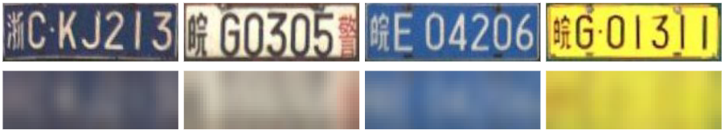

# Super-Resolution of License Plate Images Using Attention Modules and Sub-Pixel Convolution Layers

We introduce a Single-Image Super-Resolution (SISR) approach that integrates attention and transformer modules to enhance the detection of structural and textural features in LR images. Our approach incorporates sub-pixel convolution layers (also known as PixelShuffle) and a loss function that uses an Optical Character Recognition (OCR) model for feature extraction. We trained the proposed architecture on synthetic images created by applying heavy Gaussian noise to high-resolution LP images from two public datasets, followed by bicubic downsampling. As a result, the generated images have a Structural Similarity Index Measure (SSIM) of less than 0.10. Our results show that our approach for reconstructing these low-resolution synthesized images outperforms existing ones in both quantitative and qualitative measures. Comprehensive details can be found in our [paper](https://doi.org/10.1016/j.cag.2023.05.005).

# LR-HR Pairs

The **High-Resolution (HR)** images used in our experiments were generated as follows. For each image from the chosen datasets, we first cropped the LP region using the annotations provided by the authors. We then used the same annotations to rectify each LP image, making it more horizontal, tightly bounded, and easier to recognize. The rectified image serves as the HR image.

We generated **Low-Resolution (LR)** versions of each HR image by simulating the effects of an optical system with lower resolution. This was achieved by iteratively applying random Gaussian noise to each HR image until we reached the desired degradation level for a given LR image (i.e., SSIM < 0.1). To maintain the aspect ratio of the LR and HR images, we padded them before resizing.

Here are some HR-LR image pairs created from the [RodoSol-ALPR](https://github.com/raysonlaroca/rodosol-alpr-dataset) dataset:


And here are some examples of HR-LR image pairs created from the [PKU](https://github.com/ofeeler/LPR) dataset:


### How to obtain the RodoSol-SR and PKU-SR datasets

As we are not the creators of the [RodoSol-ALPR](https://github.com/raysonlaroca/rodosol-alpr-dataset) and [PKU](https://github.com/ofeeler/LPR) datasets, we have decided to grant access to the images we have generated from these datasets upon request, subject to the signing of a licensing agreement. In essence, the RodoSol-SR and PKU-SR datasets are released for academic research only and are free to researchers from educational or research institutes for **non-commercial purposes**.

To be able to download the datasets, please read [**this license agreement**](./Media/license-agreement.pdf) carefully, fill it out and send it back to the second author ([rblsantos@inf.ufpr.br](mailto:rblsantos@inf.ufpr.br)) (who also manages access to the [RodoSol-ALPR](https://github.com/raysonlaroca/rodosol-alpr-dataset) dataset). **Your e-mail must be sent from a valid university account** (.edu, .ac or similar).

In general, you will receive a download link within 3-5 business days. Failure to follow the instructions may result in no response.

# Usage

- \_\_dataset\_\_.py

    Before using the code provided, not that the image size must be changed for the input LR and output SR/HR to the desired shape on the __dataset.py__ file after the imports:

    ```python
    # RosoSol-SR
    IMG_LR = (40, 20)
    IMG_HR = (160, 80)
    
    # PKU-SR
    IMG_LR = (48, 16)
    IMG_HR = (192, 64)
    ```
    Also, in the class customDataset the parameter self.aspect_ratio must reflect the desired aspect ration. In our work for the PKU and RodoSol dataset we used the values 3.0 and 2.0     respectively:
 
    ```python
    # RosoSol-SR
    def __init__(self, x_tensor, augmentation = True):
        self.aspect_ratio = 2.0

    # PKU-SR
    def __init__(self, x_tensor, augmentation = True):
        self.aspect_ratio = 3.0
    ```
- __training.py__ and __testing.py__

    In each training.py and testing.py files we must define the path of the OCR to be used (download the pre-trained OCRs (here)[https://github.com/Valfride/lpr-rsr-ext/releases/tag/OCR_pre-trained_models]):
 
    ```python
    # RosoSol-SR
    path_ocr = Path('./saved_models/RODOSOL_ALPR')
    
    # PKU-SR
    path_ocr = Path('./saved_models/CHINESE_ALPR')
    
# Citation

If you use our code or datasets in your research, please cite:
* V. Nascimento, R. Laroca, J. A. Lambert, W. R. Schwartz, D. Menotti, “Super-Resolution of License Plate Images Using Attention Modules and Sub-Pixel Convolution Layers,” in *Computers & Graphics*, vol. 113, pp. 69-76, 2023. [[Science Direct]](https://doi.org/10.1016/j.cag.2023.05.005) [[arXiv]](https://arxiv.org/abs/2305.17313)

```
@article{nascimento2023super,
  title = {Super-Resolution of License Plate Images Using Attention Modules and Sub-Pixel Convolution Layers},
  author = {V. {Nascimento} and R. {Laroca} and J. A. {Lambert} and W. R. {Schwartz} and D. {Menotti}},
  year = {2023},
  journal = {Computers \& Graphics},
  volume = {113},
  number = {},
  pages = {69-76},
  doi = {10.1016/j.cag.2023.05.005},
  issn = {0097-8493},
  keywords = {License plate recognition, Super-resolution, Attention modules, Sub-pixel convolution layers}
}
```

You may also be interested in the [conference version](https://github.com/valfride/lpr-rsr/) of this paper:
* V. Nascimento, R. Laroca, J. A. Lambert, W. R. Schwartz, D. Menotti, “Combining Attention Module and Pixel Shuffle for License Plate Super-resolution,” in *Conference on Graphics, Patterns and Images (SIBGRAPI)*, pp. 228-233, Oct. 2022. [[IEEE Xplore]](https://doi.org/10.1109/SIBGRAPI55357.2022.9991753) [[arXiv]](https://arxiv.org/abs/2210.16836)

Additionally, consider showing your support by starring (:star:) this repository.

## Related publications

A list of all our papers on ALPR can be seen [here](https://scholar.google.com/scholar?hl=pt-BR&as_sdt=0%2C5&as_ylo=2018&q=allintitle%3A+plate+OR+license+OR+vehicle+author%3A%22David+Menotti%22&btnG=).

## Contact

Please contact Valfride Nascimento ([vwnascimento@inf.ufpr.br](mailto:vwnascimento@inf.ufpr.br)) with questions or comments.

